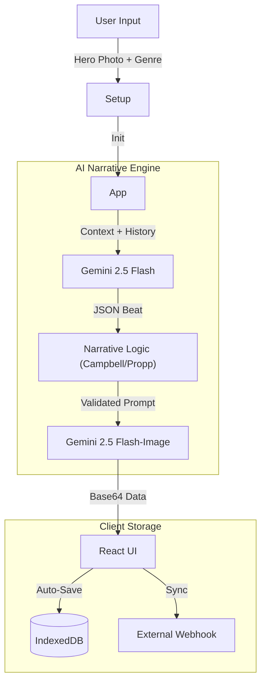
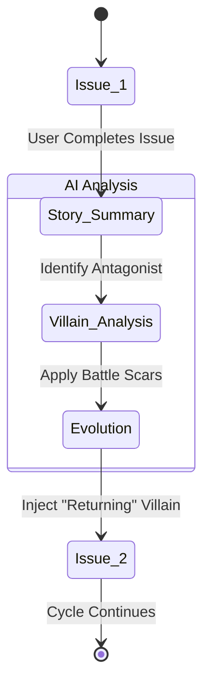

# 🦸‍♂️ Infinite Heroes: The AI Serial Comic Engine

[](https://comics.zae.life/)

**Infinite Heroes** is a client-side, multimodal AI application that turns users into the protagonists of an infinite, evolving comic book series.

Built with **React 19** and the **Google Gemini API**, it goes beyond simple image generation by implementing a persistent "Nemesis System," structured narrative theory, and complex state management to create a cohesive reading experience.

---

## 🌟 Core Features

### 1. The Nemesis System (Serial Continuity)
Unlike one-shot generators, Infinite Heroes remembers.
*   **Villain Evolution:** If you finish Issue #1, the app summarizes the story and generates a "Villain Sheet" for the next issue.
*   **Visual Memory:** The antagonist returns in Issue #2 with visual changes based on the previous battle (e.g., "scarred armor," "cybernetic eye").
*   **Genre Rotation:** The app automatically rotates sub-genres (Horror → Action → Sci-Fi) to simulate a long-running comic series.

### 2. The Shared Multiverse
*   **Script Sharing:** Users can generate a unique URL containing the *script* of their comic (dialogue, choices, scenes).
*   **Re-Casting:** When another user opens a shared link, they are prompted to upload *their* own photo. The app then re-renders the entire comic using the shared script but starring the *new* user.

### 3. Infinite Storage & Cloud Sync
*   **IndexedDB:** The app uses a custom wrapper around the browser's `IndexedDB` to store gigabytes of Base64 comic pages, bypassing standard `localStorage` limits.
*   **Webhook Sync:** Power users can provide a Webhook URL (n8n, Zapier, Make). The app pushes the full game state JSON to this endpoint, enabling external backups or CMS integrations.

### 4. Dynamic Visuals
*   **Parallax 2.5D:** Panels feature interactive mouse-tracking parallax effects.
*   **Ken Burns Effect:** AI-generated panels are animated with pans and zooms to create a "Motion Comic" feel.
*   **Visual Mediums:** Users can override the standard comic style with "Claymation", "Ukiyo-e", "Pixel Art", and more.

---

## 🧠 Architecture & Flow

### The Generation Pipeline



### The Nemesis Loop



---

## 🛠️ Stack & Dependencies

*   **Frontend:** React 19, Tailwind CSS
*   **AI:** `@google/genai` (Gemini 2.5 Flash & Flash-Image)
*   **Storage:** Native `IndexedDB` (via `db.ts` wrapper)
*   **PDF:** `jspdf` for physical issue printing
*   **Fonts:** 'Bangers' (Headers), 'Neucha' (Handwritten/Cyrillic support)

---

## 📦 Setup & Usage

### 1. Prerequisites
You need a **Google Gemini API Key**.
*   The key is stored **locally** in your browser.
*   It is never sent to any server other than Google's API endpoints.

### 2. Installation
```bash
npm install
npm start
```

### 3. Webhook Integration (Optional)
To back up your runs to the cloud:
1.  Create a webhook in n8n/Zapier.
2.  Go to the App Setup screen -> "Cloud Sync & Backup Settings".
3.  Paste the URL.
4.  Click "Sync". The app will POST the full `SavedState` JSON body.

---

## 🎨 Customization

### Adding New Genres/Styles
Modify `types.ts`:
```typescript
export const GENRES = [..., "Cyberpunk Western", "Eldritch Cooking Show"];
export const ART_STYLES = [..., "80s Anime", "Charcoal Sketch"];
```

### Adjusting Pacing
Modify `aiService.ts` -> `STORY_CIRCLE` object to change the narrative beats per page.

---

## 📸 Gallery


*(Example of a generated parallax panel with text overlay)*

---

## 📜 License

Apache-2.0